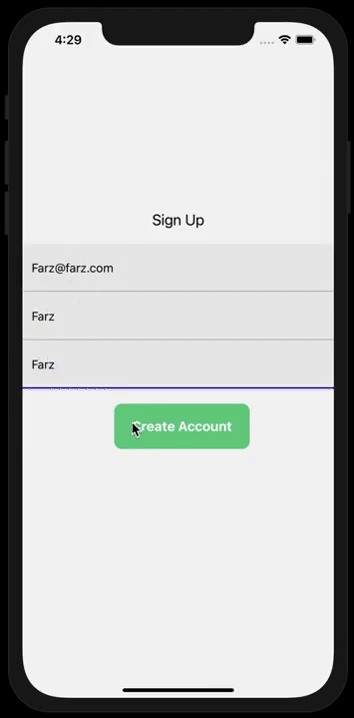

# THE APP - A delivery app that lets you order anything you want!

# What this app is about

The main goal of this app is to let you ordor anything you want. From a couple of items you forgot to buy at the grocery store or a new shirt from a clothing store for your next job interview. The APP will give you the opportunity to order anything you want from anywhere and received it in minutes.

# Table of contents

- App demo
- Used technologies and concepts
- Goals for this project
- User stories
- Project board
- Wireframe
- Datamodel
- Backend server repo

# App demo

# Used technologies and concepts

# 👇 Click links to see code samples in this project 👇

Express server
Sequelize as ORM
One-to-many and many-to-many models

React native ⭐
GraphQL ⭐

⭐ New technology learned during this project

# Goals for this project

The goal of this project is to build a full-stack app, practicing known and exploring new technologies (see above). I learned these new tools independently by reading its documentation, consultin forums like StackExchange and watching online videos.

- practice full-stack app development
- build a working prototype in 2 weeks
- apply what we learned in Codaisseur's bootcamp
- extend with new technology independently
- showcase and document development skills using:
- wireframes as Minimum Viable Product
- conscious data model design
- user stories perspective
- agile/kanban project approach
- transparant and structured git version control

# User stories

- as a user I want to be able to create an account
- as a user I want to be able to login
- as a user I want to be able to view all products available per store
- as a user I want to be able to add products to my cart & place an order
- as a user I want to be able to view all added products on my order details page before checkout
- as a user I want to be able to checkout and pay for my products
- as a user I want to be able to track my order

# Project Board

Go to project board

# Wireframe

[mockup]:

# Datamodel

Go to datamodel

# Backend server repo

The backend side of this project is an Express server using Sequelize to manage the underlying Postgres database and GraphQL to communicate with the client. Click here for more details

 https://wireframepro.mockflow.com/view/M6400d393c162ec72587d0b485a20e69b1602502764628
[dill]: https://github.com/joemccann/dillinger
[git-repo-url]: https://github.com/joemccann/dillinger.git
[john gruber]: http://daringfireball.net
[df1]: http://daringfireball.net/projects/markdown/
[markdown-it]: https://github.com/markdown-it/markdown-it
[ace editor]: http://ace.ajax.org
[node.js]: http://nodejs.org
[twitter bootstrap]: http://twitter.github.com/bootstrap/
[jquery]: http://jquery.com
[@tjholowaychuk]: http://twitter.com/tjholowaychuk
[express]: http://expressjs.com
[angularjs]: http://angularjs.org
[gulp]: http://gulpjs.com
[pldb]: https://github.com/joemccann/dillinger/tree/master/plugins/dropbox/README.md
[plgh]: https://github.com/joemccann/dillinger/tree/master/plugins/github/README.md
[plgd]: https://github.com/joemccann/dillinger/tree/master/plugins/googledrive/README.md
[plod]: https://github.com/joemccann/dillinger/tree/master/plugins/onedrive/README.md
[plme]: https://github.com/joemccann/dillinger/tree/master/plugins/medium/README.md
[plga]: https://github.com/RahulHP/dillinger/blob/master/plugins/googleanalytics/README.md
